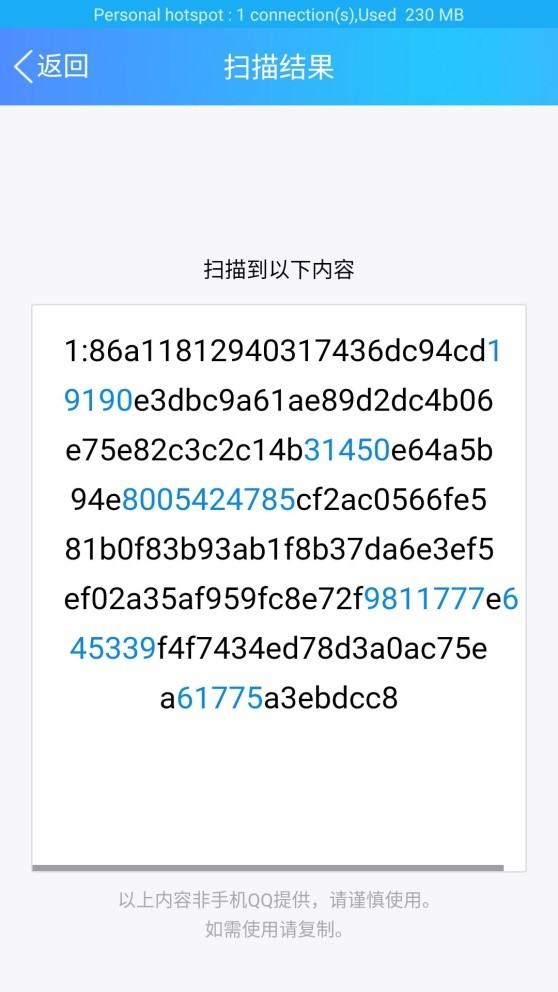
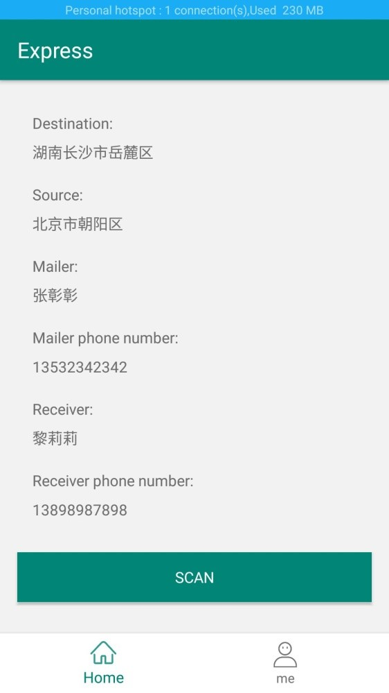
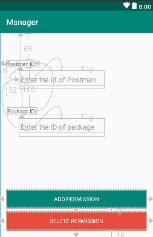
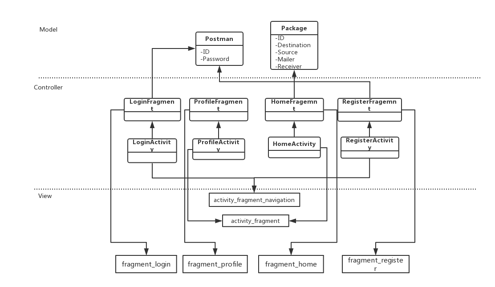
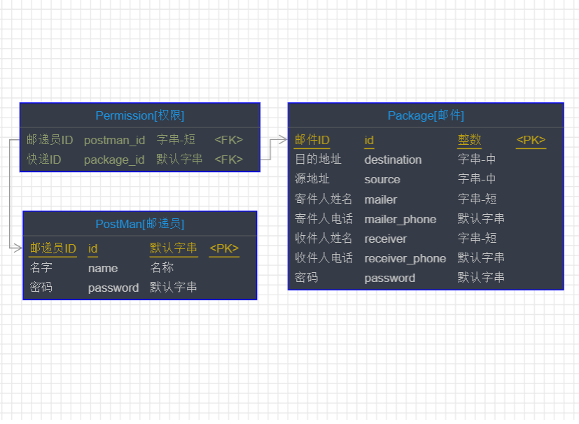

# Express
This repository contains 2 apps:express and manager. These two android app share a common server.

Express is a Secure Express System based on QR code.

The personal information of packages are encrypted(with AES) and encoded to QR code. Only the authorized courier with permission are able to acquire the information from the code.Those who do not have permission will only get a messy code from the QR code.

For example, the following QR code contains the information of package(id=1).

If the scanner do not have permission, or did not use the app "Express" to scan the above QR code, this is what will he get:smirk:

However, if the manager give you the permission to look at the package's information, this is what you will get:

# Manager

the app for manager to add/delete permissions. 

# MVC Structure

# Database
Database design:

# How to run Server?

1. open cmd.
2. change the directory to 'ExpressServer'
3. enter command:
> npm run dev

## How to create QR code
After you have successfully compile and run server. You can use the following interface to create a QR image of a package.
> localhost:3001/create_qr?id=packageid
